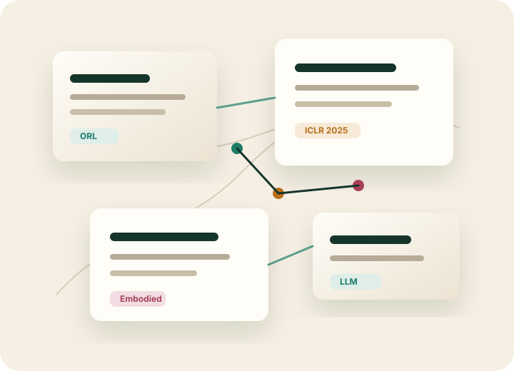

<section class="landing-hero" markdown>

Offline RL · Embodied AI · LLM

# 坚守离线强化学习阵地的小陈

一个专注于离线强化学习领域的博士生，但对于具身智能也很关注哟！ 每天读一点 ORL，也顺手望一望具身智能与大模型的新风向。

<a class="primary-action" href="offline_rl/">进入 ORL 主阵地</a>
<a class="secondary-action" href="embodied_llm/">观察具身智能与 LLM</a>

</section>

<section class="metrics-row">

<strong>1</strong>篇已上传 ORL 笔记

<strong>6</strong>类 ORL 来源

<strong>30</strong>个年份入口

<strong>1</strong>个已有内容入口

</section>

<section class="section-head" markdown>

## 阅读地图

目标是每天阅读约 10 篇论文：重点精读 ORL，快速扫读具身智能、LLM 与智能体方向。
</section>

<section class="conf-grid">
<article class="conf-card">

Main Track

<h2><a href="offline_rl/">离线强化学习</a></h2>

按 ICLR、ICML、NeurIPS、AAMAS、其他会议和期刊文章组织，并固定 2022-2026 年入口。

<a class="chip" href="offline_rl/iclr/2025/">ICLR 2025 1</a>
<a class="chip" href="offline_rl/">全部 ORL 入口</a>

</article>
<article class="conf-card">

Frontier Watch

<h2><a href="embodied_llm/">具身智能与 LLM</a></h2>

保留行业动态与相关论文两个入口，用来追踪大模型、智能体和具身系统的最新进展。

<a class="chip" href="embodied_llm/industry_updates/">行业最新动态</a>
<a class="chip" href="embodied_llm/related_papers/">相关论文</a>

</article>
</section>
