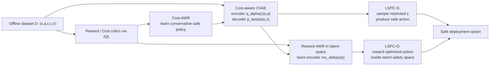

# Latent Safety-Constrained Policy Approach for Safe Offline Reinforcement Learning

<div class="paper-hero">
<p class="paper-meta">Prajwal Koirala, Zhanhong Jiang, Soumik Sarkar, Cody Fleming · ICLR 2025 Poster · ICLR / 2025</p>
<div class="tag-row"><span>Safe Offline RL</span><span>Latent Safety Constraints</span><span>CVAE</span><span>Advantage Weighted Regression</span><span>Constrained MDP</span></div>
</div>

<article class="note-body" markdown>

**一句话概括：** LSPC 先用 CVAE 从离线数据中学习一个保守安全策略与 latent safety constraint，再用 reward-Advantage Weighted Regression 在受限隐空间中寻找高回报动作，从而缓解 safe offline RL 中“过度保守低奖励”和“放松约束高风险”的矛盾。

**论文的定位：** 这是一篇 safe offline RL 论文，位于 offline RL 的 distribution shift 控制、safe RL 的 CMDP 约束建模、以及生成模型式行为支持建模的交叉处。它与 BC-Safe 的区别是不用只克隆安全子集，而是通过 cost advantage 加权学习安全 latent；与 CDT 的区别是不用依赖难调的 reward/cost prompt；与 FISOR/CPQ 的区别是把安全约束转移到 CVAE latent space 中，以可调 restriction hyperparameter 控制安全-奖励权衡。论文的主张是：先学一个保守的“安全动作生成空间”，再在这个空间里优化奖励，比直接在原动作空间做 constrained policy learning 更稳。

## 1. 第一作者相关信息

第一作者 **Prajwal Koirala**。论文首页给出的单位是 **Iowa State University, Ames, Iowa, USA**，作者邮箱为 `{prajwal, zhjiang, soumiks, flemingc}@iastate.edu`。公开页面和论文记录显示，Prajwal Koirala 的研究围绕 offline RL、safe RL、自动驾驶/机器人控制和序贯决策中的安全约束学习展开；与 Cody Fleming、Soumik Sarkar 等 Iowa State University 研究者合作紧密。

近期可核验论文脉络如下。由于作者名在 Google Scholar / Semantic Scholar / OpenReview 等平台的覆盖可能不完全，下表以公开检索到的同名作者论文和本文相关方向为主，不能视为完整 publication list。

| 年份 | 论文 | Venue/source | topic tag | 与本文关系 |
|---|---|---|---|---|
| 2024 | Solving Offline Reinforcement Learning with Decision Tree Regression | CoRL 2024 / public paper pages | offline RL, regression formulation | 体现第一作者对“把 offline RL 转成监督/回归问题”的兴趣 |
| 2024 | F1Tenth Autonomous Racing with Offline Reinforcement Learning Methods | ITSC 2024 / public paper pages | autonomous driving, offline RL | 与安全控制和自动驾驶场景相关 |
| 2025 | Latent Safety-Constrained Policy Approach for Safe Offline Reinforcement Learning | ICLR 2025 Poster / OpenReview / arXiv | safe offline RL, latent constraints | 当前论文 |
| 2025 | Feasibility Informed Advantage Weighted Regression | CDC 2025 / public records | safe RL, feasibility, AWR | 与本文同样使用 AWR 思路处理安全/可行性 |
| 2025 | LexiSafe: Offline Safe RL with Lexicographic Safety-Reward Hierarchy | CoRR / arXiv | safe offline RL, lexicographic safety | 可视为本文“安全优先、奖励其次”思想的后续或相邻方向 |

总体上，第一作者的研究主线可以概括为：**在离线数据中学习可部署策略，同时把安全、可行性或约束满足显式纳入策略提取过程**。本文的 LSPC 属于这条线中较核心的一篇：它把安全约束从显式 cost threshold 优化转成 latent-space restriction，使策略既不完全停留在安全子集行为克隆，也不直接暴露在 OOD 动作风险里。

## 2. 研究问题

本文研究的是 **safe offline reinforcement learning**。普通 offline RL 只从静态数据集学习策略，不能与环境继续交互；safe RL 则要求策略在最大化奖励的同时满足安全成本约束。两者合起来之后，问题变得更尖锐：算法既不能在线试错，也不能为了追求高 reward 去访问数据覆盖不足或不安全的动作区域。

论文使用 CMDP 形式描述 safe RL。给定状态空间、动作空间、转移、奖励函数和成本函数，目标是：

$$
\max_{\pi}\ \mathbb{E}_{\tau\sim\pi}[R(\tau)]
\quad
\text{s.t.}
\quad
\mathbb{E}_{\tau\sim\pi}[C(\tau)] \le \kappa .
$$

其中 $R(\tau)$ 是轨迹累计奖励，$C(\tau)$ 是轨迹累计成本，$\kappa$ 是允许的安全成本阈值。

在 offline setting 中，论文进一步把问题写成：

$$
\max_{\pi} V_r^\pi(s)
\quad
\text{s.t.}
\quad
V_c^\pi(s) \le \kappa,\quad
D_{\mathrm{KL}}(\pi\|\pi_b)\le \epsilon_1 .
$$

这里 $\pi_b$ 是离线数据背后的未知行为策略。第二个 KL 约束表达的是 offline RL 的典型需求：目标策略不要离数据支持太远，否则 Q 函数会在 OOD 动作上外推出错。

本文要解决的核心矛盾是：

- 如果约束太强，策略会像 BC-Safe 或 FISOR 那样很安全但奖励低。
- 如果约束太弱，策略可能像部分 CDT/CPQ 设置那样追求高奖励却违反成本约束。
- 如果只过滤安全数据再行为克隆，换一个成本阈值 $\kappa$ 可能就需要重新筛数据和训练。
- 如果直接在原动作空间做 constrained optimization，安全约束和行为支持约束都难以稳定实现。

LSPC 的问题定义可以压缩成一句话：**如何仅凭包含 reward/cost 标签的离线数据，学习一个既在安全约束内、又能尽量提高奖励的策略？**

## 3. 背景知识

| term | plain Chinese meaning | role in this paper |
|---|---|---|
| Safe RL | 强化学习不仅最大化奖励，还要满足安全成本限制 | 本文目标领域 |
| Offline RL | 只能使用预先收集的数据，训练时不能继续交互 | 引入 distribution shift 和 OOD 动作风险 |
| CMDP | 带成本约束的 MDP | 用于形式化 reward maximization + cost constraint |
| Cost return | 轨迹上的累计安全违规成本 | 判断策略是否安全 |
| Behavior policy $\pi_b$ | 产生离线数据的未知策略 | 策略不能偏离其数据支持太远 |
| CVAE | 条件变分自编码器 | 建模状态-动作分布并生成数据支持内动作 |
| Latent safety constraint | 隐空间中的安全约束区域 | LSPC 的核心抽象 |
| LSPC-S | conservative safe policy | 保守安全策略，可作安全备份 |
| LSPC-O | reward-optimized policy in latent safety space | 在受限安全隐空间内优化奖励 |
| IQL | Implicit Q-Learning | 训练 reward/cost critic |
| AWR | Advantage Weighted Regression | 从 critic 中提取安全/高奖励策略 |

**为什么 safe offline RL 难？**  
Online safe RL 可以通过在线交互逐步发现哪些动作危险，但这本身有安全风险。Offline RL 避免了在线试错，却只能依赖静态数据。如果策略选择数据集中很少见的动作，critic 对 reward 和 cost 的估计都可能不可靠。因此 safe offline RL 要同时处理两个约束：动作要在数据支持内，且要满足安全成本。

**CVAE 在这里做什么？**  
CVAE 学习一个条件生成模型：给定状态 $s$ 和隐变量 $z$，decoder 生成动作 $a$。如果 $z$ 来自训练时见过的高概率区域，decoder 更可能生成离线数据支持内的动作。LSPC 进一步把这个 latent space 用作安全约束空间：先通过 cost-aware AWR 让 CVAE 更偏向重构低成本动作，再限制采样的 $z$ 区域，让生成动作更保守安全。

**IQL/AWR 在这里做什么？**  
IQL 用离线数据训练 reward Q、cost Q 和 value 网络，避免在训练 critic 时查询 OOD 动作。AWR 用 advantage 作为权重做监督学习：优势越好的样本，权重越大。本文分别使用 cost advantage 学 LSPC-S，使用 reward advantage 学 LSPC-O 的 latent encoder。

**为什么本文动机成立？**  
如果直接学一个高奖励策略，可能违反安全约束；如果只学安全动作，可能丢掉高奖励机会。LSPC 的思路是先构造一个“安全且在数据支持内”的动作生成空间，再在这个空间中找高奖励动作。这样安全和奖励被部分解耦：CVAE/latent restriction 负责安全与支持，reward-AWR 负责性能优化。

## 4. 问题分析

论文的分析围绕 safe offline RL 的三重困难展开。

第一，**离线数据带来 OOD 外推问题**。论文在 Introduction 和 Section 2 中强调，目标策略如果偏离行为策略 $\pi_b$，reward/cost critic 都会在数据未覆盖区域出错。因此 Eq. 2 中加入 $D_{\mathrm{KL}}(\pi\|\pi_b)\le \epsilon_1$ 这样的行为正则化思想。

第二，**安全约束不能只靠硬过滤**。BC-Safe 只在安全子集上克隆，这在安全上直观，但丢掉了带高奖励信息的非安全或边界样本；如果成本阈值变化，还可能需要重新过滤数据。论文希望不要求大量纯安全数据，而是只要求数据中存在非空安全子集，这一点在 Appendix A.2 的 Assumption 6 中被用于样本复杂度分析。

第三，**奖励优化与安全约束需要可调解耦**。Figure 1 给出 LSPC 的框架：CVAE encoder/decoder 负责学习 latent safety space，另一个 encoder $\mu_\delta(z|s)$ 在这个 latent space 内寻找高 reward action。Figure 4 进一步显示 restriction hyperparameter 控制安全-奖励权衡：放宽 latent restriction 会提升 LSPC-O 的 reward，但也会提高 cost；因此 $\epsilon$ 不是装饰性超参，而是安全部署时必须关注的旋钮。

根据 Figure 1，LSPC 的核心数据流可以重画为：



这张图对应论文 Figure 1(a)/(b)：安全约束不再直接写成原动作空间中的硬约束，而是通过 CVAE 的 latent representation 与受限采样区域来施加。

## 5. 思想与方法

LSPC 的核心思想是：**用 CVAE 学一个安全优先的隐空间，再在这个隐空间里做奖励最大化**。

方法分两步。

第一步是 **Learning Conservatively Safe Policy**。论文用 CVAE 建模行为策略，并通过 cost advantage weighting 让 CVAE 更倾向于重构低成本动作。CVAE 的标准目标来自 ELBO：

$$
\log \pi_b(a|s)
\ge
\mathbb{E}_{z\sim q_\alpha(z|s,a)}[\log p_\beta(a|s,z)]
-
D_{\mathrm{KL}}(q_\alpha(z|s,a)\|p(z|s,a)).
$$

在 LSPC 中，这个目标被 cost-aware AWR 权重修正。直觉是：如果某个动作的 cost advantage 更好，即预计更安全，那么它在 CVAE 重构目标中的权重更大。这样训练出的 decoder $p_\beta(a|s,z)$ 更倾向于生成安全且位于数据支持内的动作。

第二步是 **Constrained Reward-Return Maximization**。在已学好的安全 decoder 上，训练一个 latent safety encoder policy $\mu_\delta(z|s)$，用 reward advantage weighting 找到更高回报的 latent embedding。decoder 参数 $\beta$ 冻结，但梯度可以穿过 decoder 回传到 $\delta$。最终 LSPC-O 的动作来自：

$$
z \sim \mu_\delta(\cdot|s),\quad
z \in (-\epsilon,\epsilon),\quad
a \sim p_\beta(\cdot|s,z).
$$

其中 $\epsilon$ 控制 latent space restriction：小 $\epsilon$ 更保守，大 $\epsilon$ 给 reward optimization 更多空间，但可能提高 cost。

### 理论分析与保证

论文的理论集中在 Section 4 和 Appendix A.2。它没有证明深度神经网络实现的全局最优训练，但给出了分布距离假设下的 performance gap、constraint violation 和样本复杂度界。

| Result | Assumptions | Conclusion | Intuition | Limitation |
|---|---|---|---|---|
| Lemma 1 | stationary distributions for $\pi$ and $\pi^\star$ | state distribution TV distance 可由 policy TV distance 控制 | 策略差异会沿 MDP 传播成状态分布差异 | 依赖折扣因子，误差随 $(1-\gamma)^{-1}$ 放大 |
| Theorem 1 | $D_{\mathrm{KL}}(\pi\|\pi_s)\le\epsilon_1'$ and $D_{\mathrm{KL}}(\pi_s\|\pi^\star)\le\epsilon_2'$ | reward performance gap 被 $\sqrt{\epsilon_1'/2}+\sqrt{\epsilon_2'/2}$ 控制 | 如果 LSPC-O 接近安全策略，安全策略又接近最优策略，则性能差距小 | 是 worst-case bound，不直接说明实际优化能达到这些 KL |
| Theorem 2 | 同 Theorem 1 | constraint violation 被类似形式控制 | reward 和 cost critic 都基于 IQL/AWR，误差传播结构相似 | 仍是分布距离假设下的上界 |
| Theorem 3 | Donsker class assumption + safe subset nonempty | performance gap decays as $O(1/N^{0.25+\xi})$ | 数据越多，策略分布误差越小 | 样本复杂度较差，且是 worst-case |
| Theorem 4 | 同 Theorem 3 | constraint violation decays as $O(1/N^{0.25+\xi})$ | 足够多数据下 cost violation 趋近变小 | 依赖经验过程假设和安全样本存在 |

Theorem 1 的核心形式可以理解为：

$$
V_r^{\pi^\star}(\rho_0)-V_r^\pi(\rho_0)
\le
\frac{2R_m}{(1-\gamma)^2}
\left(
\sqrt{\frac{\epsilon_1'}{2}}
+
\sqrt{\frac{\epsilon_2'}{2}}
\right).
$$

Theorem 2 则把 $R_m$ 换成 cost 上界 $C_m$，约束违规 $V_c^\pi(\rho_0)-\kappa$ 也由同样的分布距离项控制。

我的判断：理论部分最有价值的是把 $\pi_b$ 换成中间安全策略 $\pi_s$。作者认为 $\pi_s$ 是行为策略的安全重构，因此比直接相对行为策略做约束更贴近安全目标，也能给出更紧的直觉解释。但理论仍强依赖 $\pi_s$ 与 $\pi^\star$ 的 KL 距离假设，实践中这个假设是否成立主要由实验间接支持。

## 6. 算法与伪代码

论文 Algorithm 1 的 PDF 抽文本排版较乱，按正文和算法框可重写如下。

```text
Algorithm: LSPC Training
Input:
  Offline dataset D = {(s, a, r, c, s')}
  Learning rates for critics, CVAE, latent encoder
  AWR temperatures lambda for safety, zeta for reward
  Latent restriction epsilon

Initialize:
  Reward critic Q_r and value V_r
  Cost critic Q_c and value V_c
  CVAE encoder q_alpha(z | s, a)
  CVAE decoder p_beta(a | s, z)
  Latent safety encoder mu_delta(z | s)

Repeat for each gradient step:
  1. Sample a mini-batch B from the offline dataset D.

  2. TD learning with IQL:
     2.1 Update reward value V_r by expectile regression.
     2.2 Update reward critic Q_r with TD target r + gamma V_r(s').
     2.3 Update cost value V_c by expectile regression.
     2.4 Update cost critic Q_c with TD target c + gamma V_c(s').

  3. Learn conservative safe CVAE policy:
     3.1 Compute cost advantage A_c(s,a) = V_c(s) - Q_c(s,a).
     3.2 Update q_alpha and p_beta with cost-AWR weighted CVAE loss.
     3.3 This yields LSPC-S by sampling restricted z and decoding a = p_beta(s,z).

  4. Learn reward-optimized latent policy:
     4.1 Freeze decoder p_beta.
     4.2 Sample z from mu_delta(z | s), then squash/restrict z into (-epsilon, epsilon).
     4.3 Decode action a = p_beta(s,z).
     4.4 Update mu_delta with reward-AWR objective using A_r(s,a) = Q_r(s,a) - V_r(s).

Output:
  LSPC-S: conservative safe policy
  LSPC-O: reward-optimized policy constrained inside latent safety space
```

### 逐步解释

1. **IQL critic 训练**：先学 reward/cost 两套 critic，避免在 critic 学习时查询策略生成的 OOD 动作。
2. **cost-AWR CVAE**：用低成本动作更高的权重训练 CVAE，使 latent space 的高概率区域偏向安全动作。
3. **restricted latent sampling**：推理时不从完整 $N(0,1)$ 采样，而是把 latent 限制在 $(-\epsilon,\epsilon)$，获得更保守的 LSPC-S。
4. **reward-AWR latent encoder**：不直接修改 decoder，而是在安全 decoder 的输入 latent 上寻找高 reward embedding，得到 LSPC-O。
5. **安全备份**：LSPC-S 始终存在，可在安全优先场景中作为保守策略；LSPC-O 用于在可接受成本范围内提高奖励。

理论算法与实践实现之间的差距在于：理论分析用分布距离、Donsker class 和样本复杂度假设解释性能/安全界；实际训练则依赖深度 IQL、AWR 权重、CVAE 表达能力、restriction hyperparameter 和 benchmark 中的 cost labels。

## 7. 实验与消融

论文在 **Metadrive**、**Safety Gymnasium** 和 **Bullet Safety Gym** 上评估。指标为 normalized reward return 和 normalized cost return，其中 cost 小于 1 表示满足安全阈值。每个数据集使用三个目标成本阈值，并跨三个 random seeds 评估。

Baselines 包括：

| Baseline | 思路 | 主要局限 |
|---|---|---|
| BC-Safe | 只在安全子集上行为克隆 | 无奖励优化，依赖足够安全数据，换阈值可能重训 |
| CDT | 用 reward/cost 条件做 Decision Transformer | prompt 选择难，reward/cost 条件可能难同时满足 |
| CPQ | conservative policy Q-learning with constraints | 在部分任务 cost 很高或 reward 不稳定 |
| FISOR | feasibility-informed safe offline RL | 安全稳定但常过度保守 |
| LSPC-S | 本文保守安全策略 | 安全强但 reward 通常低于 LSPC-O |
| LSPC-O | 本文 reward-optimized latent safe policy | reward 更强，但依赖 restriction 调节安全边界 |

Table 1 的 domain-level 平均结果可以压缩为：

| Domain average | BC-Safe reward/cost | CDT reward/cost | CPQ reward/cost | FISOR reward/cost | LSPC-S reward/cost | LSPC-O reward/cost |
|---|---:|---:|---:|---:|---:|---:|
| Metadrive | 0.18 / 0.58 | 0.42 / 0.80 | -0.06 / 0.06 | 0.36 / 0.08 | 0.67 / 0.17 | **0.72 / 0.29** |
| Safety Gym | 0.38 / 0.51 | 0.55 / 0.85 | 0.19 / 3.48 | 0.30 / 0.11 | 0.32 / 0.32 | 0.40 / 0.27 |
| Bullet Safety Gym | 0.52 / 0.82 | **0.68 / 1.04** | 0.33 / 1.12 | 0.39 / 0.03 | 0.32 / 0.04 | 0.54 / 0.20 |

解释：LSPC-O 在 Metadrive 平均 reward 最高且 cost < 1；在 Safety Gym 中 reward 不总是最高，但安全性明显优于 CDT/CPQ；在 Bullet Safety Gym 中 CDT reward 平均更高但 cost > 1，不满足安全，LSPC-O 则保持 cost < 1。

代表性任务对比如下：

| Task | 现象 | 结论 |
|---|---|---|
| Metadrive MediumSparse | CDT reward 0.87 但 cost 1.10；LSPC-O reward 0.94 cost 0.12 | LSPC-O 同时高 reward 和安全 |
| Metadrive MediumDense | CDT cost 2.41 unsafe；LSPC-O reward 0.93 cost 0.01 | CDT 条件控制不稳定，LSPC-O 更稳 |
| Safety Gym HopperVel | LSPC-O reward 0.69 cost 0.00 | LSPC-O 能在部分 locomotion safety task 中兼顾奖励和安全 |
| Bullet CarRun | CDT reward 0.99 cost 0.65；LSPC-O reward 0.97 cost 0.13 | LSPC-O reward 接近最好且 cost 更低 |

消融和可视化：

| Figure / Study | 内容 | 结论 |
|---|---|---|
| Figure 2 | Pybullet Car Run 与 Metadrive Easy Sparse 训练曲线 | LSPC-O 在训练中保持较低 cost，同时 reward 优于或接近 baselines；FISOR 安全但 reward 低 |
| Figure 3 | action-space KDE/convex hull 可视化 | LSPC-S 收缩到安全区域，LSPC-O 在受限安全区域内选择高 $Q_r$ 动作 |
| Figure 4 | latent restriction hyperparameter $\epsilon$ | 放宽 restriction 提高 reward，但也提高 cost；$\epsilon$ 控制安全-奖励权衡 |
| Figure 5 | CVAE 和 safety encoder 角色反转 | 反转后难以同时获得低 cost 和高 reward，说明原架构中“CVAE 学安全、encoder 学奖励”的分工重要 |
| Figure 12 | Metadrive zero-shot transfer | Hard Dense 训练的 agent 转移到更简单设置时 reward 可提升，并保持安全；Easy Sparse 转移到复杂环境时性能下降 |

实验的强点是覆盖多 domain、多阈值和多个 baseline，并报告 reward/cost 双指标。弱点是部分图表以归一化指标呈现，实际部署中的原始 cost 语义需要结合任务理解；此外，人为设定的 latent restriction $\epsilon$ 对性能影响明显，论文也承认未来需要理论上指导如何选择 $\epsilon$。

## 8. 展望

研究启发：

1. Safe offline RL 可以不只依赖显式 Lagrangian 或 hard feasibility constraint，也可以把安全边界编码进生成模型的 latent space。
2. LSPC-S / LSPC-O 的双策略设计很实用：安全优先时用 LSPC-S，性能优先且有阈值空间时用 LSPC-O。
3. 对 offline RL 来说，生成模型不仅可以做 behavior cloning sampler，也可以作为“可控约束空间”的载体。
4. reward 和 cost 用两套 critic，再用不同 AWR 目标提取策略，是一种清晰的安全-奖励解耦方式。

局限与开放问题：

1. $\epsilon$ 的选择仍依赖经验调参；论文没有给出如何根据 $\kappa$ 自动选择 restriction 的理论规则。
2. 理论保证依赖 $\pi$、$\pi_s$、$\pi^\star$ 的分布距离假设，实践中难以直接验证。
3. CVAE latent space 是否真的稳定对应“安全”取决于数据质量和 cost labels；如果安全样本太少或标签噪声大，LSPC 可能退化。
4. 实验主要是仿真 benchmark，真实自动驾驶/机器人部署仍需要进一步验证。
5. LSPC-O 的 reward 优化仍可能在放宽 restriction 时提高 cost，因此需要部署时的安全监控或 fallback 策略。

后续研究方向：

1. **Adaptive latent restriction**：根据目标成本阈值 $\kappa$ 和在线/离线风险估计自动调节 $\epsilon$，减少人工超参选择。
2. **Uncertainty-aware LSPC**：在 CVAE latent space 中加入 cost uncertainty，避免在安全标签稀疏区域过度自信。
3. **Diffusion-based latent safety policy**：用 diffusion latent model 替代 CVAE，检验更强生成模型是否能提升复杂多模态动作空间中的安全-奖励权衡。

## Links

- Paper page: [OpenReview](https://openreview.net/forum?id=bDt5qc7TfO)
- arXiv: [arXiv:2412.08794](https://arxiv.org/abs/2412.08794)
- Code: [PrajwalKoirala/LSPC-Safe-Offline-RL](https://github.com/PrajwalKoirala/LSPC-Safe-Offline-RL)

</article>
